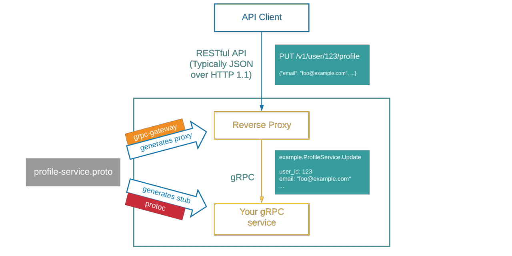

# SWE-GATEWAY-SERVICE

This is the gateway for the SWE Platform. It is responsible for routing requests to the appropriate service.

## Tech stack

- [x] [Go](https://golang.org/)
- [x] [gRPC Gateway](https://grpc-ecosystem.github.io/grpc-gateway/)
- [x] [Gin Gonic](https://gin-gonic.com/)
- [x] [Viper](https://github.com/spf13/viper)
- [x] [Docker](https://www.docker.com/)
- [x] [GitHub Actions](https://docs.github.com/en/actions)

## Grpc Gateway



## Build

```bash
  make build
  ```

## Swagger

```bash
  http://localhost:7777/swagger
  ```